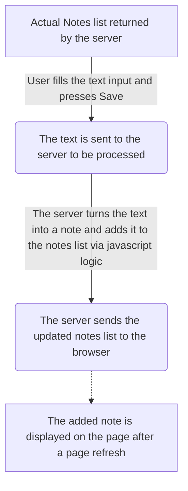

```mermaid
flowchart TD
    A[Actual Notes list returned by the server] -->|User fills the text input and presses Save| B(The text is sent to the server to be processed)
    B --->|The server turns the text into a note and adds it to the notes list via javascript logic|C(The server sends the updated notes list to the browser)
    C -.-> D[The added note is displayed on the page after a page refresh]
```
