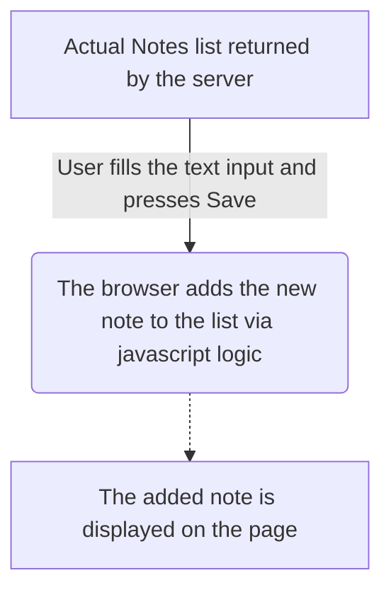

```mermaid
flowchart TD
    A[Actual Notes list returned by the server] -->|User fills the text input and presses Save| B(The browser adds the new note to the list via javascript logic)
    B -.-> C[The added note is displayed on the page]
```
